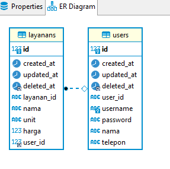
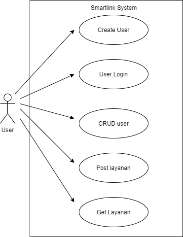
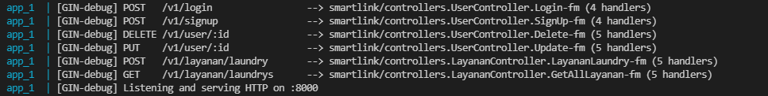
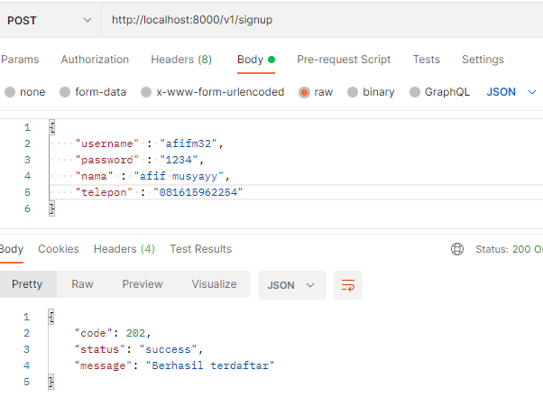
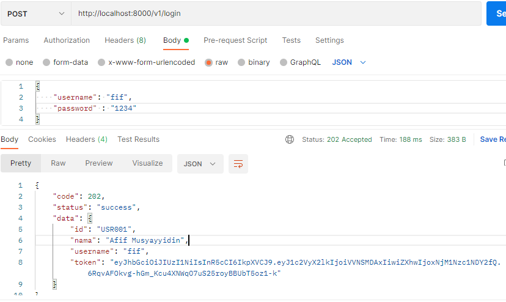
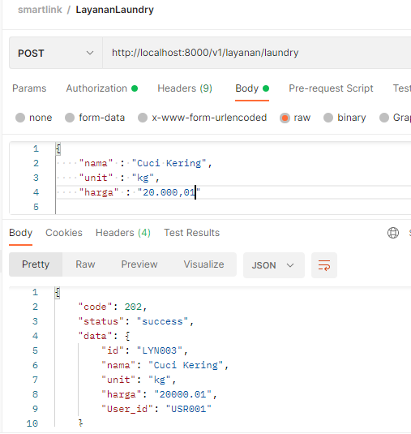

# Smartlink Test

This repository use Golang and docker-compose for build
You can use this API for Smartlink Test

## How To Build
1. Build this project, then automated Run with docker-compose
`docker-compose up --build`
2. Database and Seeder automigrate
3. Open with `http://localhost:8000/v1`

## Database Architecture

## Use Case

## API

  

1. for user register  

2. for user login  

3. for user layanan  

## Seeder
Login User with seeder
1. `{"username":"fif", "password":"1234"}`

## Maintenance
Developer : AFIF MUSYAYYIDIN

